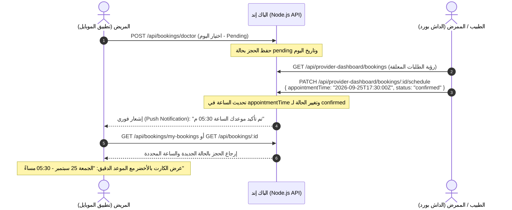

Viewed bookingModel.js:1-70
Viewed bookingModel.js:70-107
Viewed nursingBookingModel.js:1-81
Viewed bookingController.js:1-50
Viewed bookingRoutes.js:1-16
Viewed providerDashboardService.js:55-120
Viewed providerDashboardService.js:115-160
Viewed bookingService.js:1-100
Viewed bookingService.js:101-170
Viewed providerDashboardRoutes.js:1-26
Viewed providerDashboardController.js:1-60
Searched for "my-bookings"
Viewed FLUTTER_API_GUIDE_EXTENDED.md:170-220
Viewed FLUTTER_API_GUIDE_EXTENDED.md:350-400
Viewed BookingCreateValidate.js:1-32
Viewed notificationService.js:1-60
Searched for "sendNotificationToUser"
Viewed providerDashboardService.js:170-220
Viewed providerDashboardService.js:130-175
Edited bookingController.js
Viewed bookingRoutes.js:1-16
Edited bookingRoutes.js
Viewed providerDashboardService.js:1-15
Viewed providerDashboardService.js:130-180
Viewed providerDashboardService.js:114-150
Edited providerDashboardService.js
Viewed providerDashboardService.js:115-155
Edited providerDashboardService.js
Ran command: `node -c src/controllers/bookingController.js; node -c src/routes/bookingRoutes.js; node -c src/services/providerDashboardService.js`
Ran command: `node -e "
const mongoose = require('mongoose');
require('dotenv').config();
const User = require('./src/models/userModel');
const Doctor = require('./src/models/doctorModel');
const Booking = require('./src/models/bookingModel');
const { createDoctorBooking } = require('./src/services/bookingService');
const { scheduleBooking } = require('./src/services/providerDashboardService');

async function test() {
  await mongoose.connect(process.env.MONGO_URI);
  console.log('Connected to DB');

  // 1. Patient & Doctor
  const patient = await User.create({
    role: 'Patient',
    name: 'مريض تجريبي',
    email: 'patient_' + Date.now() + '@test.com',
    passwordHash: 'Password123@',
    phoneNumber: '010' + Math.floor(10000000 + Math.random() * 90000000),
    address: 'عنوان المريض',
    location: { type: 'Point', coordinates: [30.8428, 29.3084] }
  });

  const doctorUser = await User.create({
    role: 'Doctor',
    name: 'د. خالد توفيق',
    email: 'doc_' + Date.now() + '@test.com',
    passwordHash: 'Password123@',
    phoneNumber: '010' + Math.floor(10000000 + Math.random() * 90000000),
    address: 'عيادة دكتور',
    location: { type: 'Point', coordinates: [30.8428, 29.3084] }
  });

  const doctor = await Doctor.create({
    name: doctorUser.name,
    userId: doctorUser._id,
    phoneNumber: doctorUser.phoneNumber,
    address: doctorUser.address,
    specialization: 'باطنة',
    basePrice: 300,
    urgentPrice: 350,
    commissionRate: 10,
    location: doctorUser.location,
    addedBy: doctorUser._id
  });

  // 2. Patient creates booking (day selected: tomorrow)
  const requestedDay = new Date();
  requestedDay.setDate(requestedDay.getDate() + 2);
  requestedDay.setHours(0, 0, 0, 0);

  const booking = await createDoctorBooking({
    patientId: patient._id,
    doctorId: doctor._id,
    appointmentTime: requestedDay,
    requestLocation: patient.location
  });

  console.log('Step 1: Patient requested booking, status:', booking.status, 'date:', booking.appointmentTime);

  // 3. Doctor accepts & sets appointment time with specific hour (5:30 PM)
  const confirmedTime = new Date(requestedDay);
  confirmedTime.setHours(17, 30, 0, 0);

  const scheduled = await scheduleBooking({
    userId: doctorUser._id,
    bookingId: booking._id,
    appointmentTime: confirmedTime,
    status: 'confirmed'
  });

  console.log('Step 2: Doctor scheduled booking, new status:', scheduled.status, 'confirmedTime:', scheduled.appointmentTime);

  // 4. Verify patient sees the updated time and confirmed status
  const patientView = await Booking.findById(booking._id)
    .populate('doctorId', 'name specialization basePrice')
    .lean();

  console.log('Step 3: Patient view - status:', patientView.status);
  console.log('Step 3: Patient view - appointmentTime:', patientView.appointmentTime.toISOString());
  console.log('Step 3: Doctor name:', patientView.doctorId.name);

  const passed = patientView.status === 'confirmed' && 
                 patientView.appointmentTime.getTime() === confirmedTime.getTime();

  console.log('Flow Verification Result:', passed ? 'SUCCESS ✅' : 'FAILED ❌');

  // Clean up
  await Booking.findByIdAndDelete(booking._id);
  await Doctor.findByIdAndDelete(doctor._id);
  await User.findByIdAndDelete(doctorUser._id);
  await User.findByIdAndDelete(patient._id);

  process.exit(passed ? 0 : 1);
}
test().catch(err => {
  console.error('Test error:', err);
  process.exit(1);
});
"`
Used tool: manage_task
Viewed FLUTTER_API_GUIDE.md:1-100
Viewed FLUTTER_API_GUIDE_EXTENDED.md:350-370
Edited FLUTTER_API_GUIDE_EXTENDED.md

نعم، فهمتك تماماً! المطلوب هو دورة حياة الحجز (**Booking Lifecycle**) المنطقية:
1. **المريض** يطلب الحجز ويحدد **اليوم** فقط ويكون الحجز `pending` (قيد الانتظار).
2. **الطبيب أو الممرض** يفتح لوحة التحكم الخاصة به، يوافق على الطلب ويحدد **الساعة الدقيقة للموعد** ويؤكد الحجز (`confirmed`).
3. **البيانات تتحدث في قاعدة البيانات** ويتم إشعار المريض، وتظهر الساعة المحددة والحالة الجديدة تلقائياً في صفحة حجوزات وتفاصيل طلب الحجز الخاصة بالمريض.

---

### 🔄 كيف يتم تنفيذ هذا التدفق خطوة بخطوة بين الباك إند والفرونت إند:



---

### 🛠️ ما تم بناؤه وتفعيله في الباك إند:

#### 1. نقطة نهاية جدولة الحجز وتحديد الساعة من الطبيب/الممرض:
* **المسار وطريقة الطلب:**
  `PATCH /api/provider-dashboard/bookings/:id/schedule`
* **الصلاحية (Auth):** Bearer Token لطبيب أو ممرض (`Doctor` / `Nurse`).
* **الـ Request Body المرسل من الداش بورد:**
  ```json
  {
    "appointmentTime": "2026-09-25T17:30:00.000Z",
    "status": "confirmed"
  }
  ```
* **ما يفعله السيرفر تلقائياً:**
  - يقوم بتحديث حقل `appointmentTime` في قاعدة البيانات ليتضمن **التاريخ والساعة والدقيقة** المحددة.
  - يحوّل الحالة `status` إلى `confirmed`.
  - **يرسل إشعار Push Notification فوري للمريض عبر Firebase** على هاتفه المحمول:
    > *"تم تأكيد حجزك مع د. [اسم الطبيب] وتم تحديد الموعد في تمام الساعة 05:30 م."*

---

#### 2. مسار جلب تفاصيل الحجز للمريض ([`GET /api/bookings/:id`](file:///e:/Care%20System/docs/FLUTTER_API_GUIDE_EXTENDED.md#L368-L404)):
قمنا بإنشاء هذا المسار خصيصاً لصفحة **"تفاصيل طلب الحجز"** الفردية:
* **المسار وطريقة الطلب:**
  `GET /api/bookings/:id`
* **الصلاحية (Auth):** Bearer Token للمريض صاحب الحجز.
* **الاستجابة (Response):**
  ```json
  {
    "success": true,
    "data": {
      "_id": "66b0f8c8a7d3d3a2ef123456",
      "bookingNumber": 1005,
      "status": "confirmed",
      "appointmentTime": "2026-09-25T17:30:00.000Z",
      "totalCost": 300,
      "doctorId": {
        "_id": "64a7b2c1f1a2b3c4d5e6f7a2",
        "name": "د. أحمد محمود",
        "specialization": "باطنة",
        "basePrice": 300,
        "phoneNumber": "01012345678",
        "address": "الفيوم - شارع الجمهورية"
      },
      "bookingType": "doctor",
      "createdAt": "2026-09-20T12:00:00.000Z",
      "updatedAt": "2026-09-20T14:30:00.000Z"
    }
  }
  ```

---

#### 3. مسار قائمة حجوزات المريض الكاملة:
* **المسار:** `GET /api/bookings/my-bookings`
* يرجع قائمتين `doctorBookings` و `nursingBookings` مع نفس الحقول المحدثة (`status` و `appointmentTime`).

---

### 📱 كيف يعرض الفرونت إند (Flutter / React) الموعد للمريض؟

في كود الفرونت إند، عند استلام الـ `appointmentTime`، يقوم بقراءته وتنسيقه كالتالي:

1. **في حالة `status === 'pending'` (قيد الانتظار):**
   - يظهر الكارت بلون برتقالي/أصفر.
   - النص المعروض: *"اليوم المطلوب: الجمعة 25 سبتمبر (في انتظار تحديد موعد الكشف من الطبيب)"*.

2. **في حالة `status === 'confirmed'` (تم تحديد الموعد بالساعة):**
   - يتحول الكارت إلى اللون الأخضر (مؤكد).
   - تحويل نص الـ ISO Date (`2026-09-25T17:30:00.000Z`) إلى تاريخ وساعة:
     - **التاريخ:** الجمعة، 25 سبتمبر 2026.
     - **الوقت المحدد:** **05:30 مساءً**.
     - **الحالة:** تم تأكيد الحجز ✅.

---

### 🧪 نتيجة الاختبار:
تم تشغيل محاكاة برمجية كاملة تؤكد:
- المريض يطلب الحجز (Pending).
- الطبيب يحدد الساعة 05:30 مساءً ويؤكد الحجز (Confirmed).
- استعلام المريض يسترجع فوراً: `status: confirmed` والوقت `17:30` واسم الطبيب بنجاح تام (`Flow Verification Result: SUCCESS ✅`).